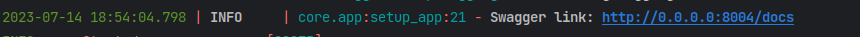

# My salary

___
<span id="0"></span>
### [Консольные команды](docs/comand.md)

### <span id="1">1. </span><span style="color:purple">Описание</span>

REST-сервис просмотра текущей зарплаты и даты следующего
повышения.

__Подробная информация по Api:__

- Swagger документация http://127.0.0.1:8000/docs
- Swagger(альтернатива) http://127.0.0.1:8000/redoc

Точная ссылка к документации выводится в логах при запуске сервиса.

___

### <span id="2">2. </span><span style="color:purple">Запуск сервиса</span>

* </span><span style="color:orange">__Клонируем репозиторий:__</span>

```bash
git clone git@github.com:VIVERA83/derbit.git
```

* </span><span style="color:orange">__Переходи в папку с проектом:__</span>

```bash
cd derbit
```

* </span><span style="color:orange">__Создаем файл .env (с переменными окружения) на основе
  примера [.env_example](.env_example)*:__</span>

```bash
echo "COMPOSE_PROJECT_NAME="my_salary"

# Настройка настройка логирования
LOGGING__LEVEL="DEBUG"
LOGGING__GURU="True"
LOGGING__TRACEBACK="False"

# Настройка Postgres
POSTGRES__DB="test_db"
POSTGRES__USER="test_user"
POSTGRES__PASSWORD="password"
POSTGRES__HOST="127.0.0.1"
POSTGRES__PORT="5435"
POSTGRES__DB_SCHEMA="my salary"

POSTGRES_DB="${POSTGRES__DB}"
POSTGRES_USER="${POSTGRES__USER}"
POSTGRES_PASSWORD="${POSTGRES__PASSWORD}"
POSTGRES_HOST="${POSTGRES__HOST}"
POSTGRES_PORT="${POSTGRES__PORT}"

# Настройка Authorization
AUTH__KEY="644bcc7e564373040999aac89e7622f3ca71fba1d972fd94a31c3bfbf24e3938"
AUTH__SECRET_KEY="strange code is written"
AUTH__ALGORITHMS=["HS256"]
AUTH__ACCESS_EXPIRES_DELTA=60
AUTH__REFRESH_EXPIRES_DELTA=172800
AUTH__ALLOWED_ORIGINS=["*"]
AUTH__ALLOW_METHODS=["HEAD", "OPTIONS", "GET", "POST", "DELETE", "PATCH"]
AUTH__ALLOW_HEADERS=["Content-Type", "Set-Cookie", "Access-Control-Allow-Headers", "Access-Control-Allow-Origin", "Authorization"]
AUTH__ALLOW_CREDENTIALS="True"

# Настройка приложения
NAME="My_salary"
HOST="0.0.0.0"
PORT="8004"
" >>.env
```

В ОС windows можно скопировать фаил [.env_example](.env_example) в `.env` командой `copy`, это будет равнозначно команде
выше

```shell
copy /Y ".env_example" ".env"
```

* </span><span style="color:orange">__Запускаем приложение в контейнере:__</span>

```bash
docker-compose up --build
```

* </span><span style="color:orange">__Открываем Swagger:__</span>

Переходим по ссылке указанной в консоли на страницу с документацией


Если запуск произведен локально то http://127.0.0.1:8000/docs
___

### [Наверх](#0)